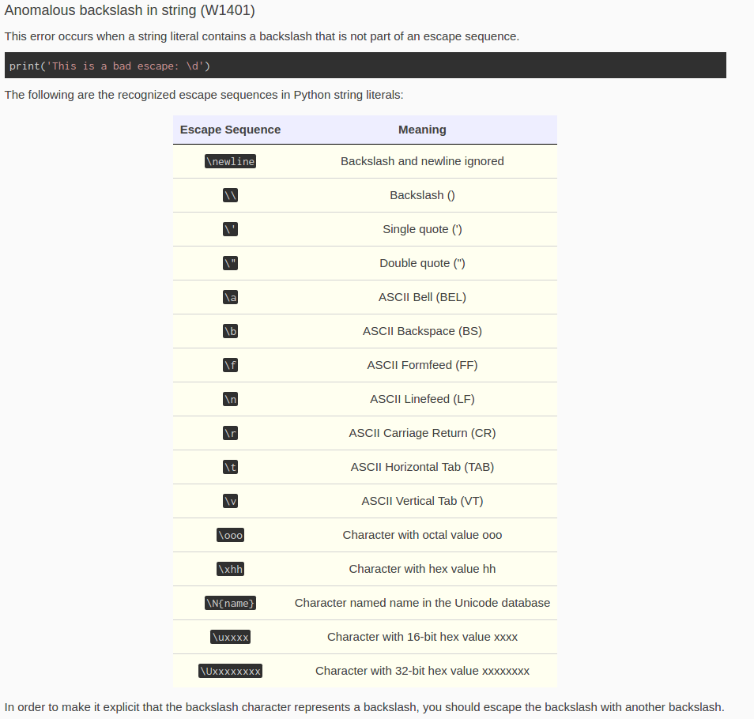
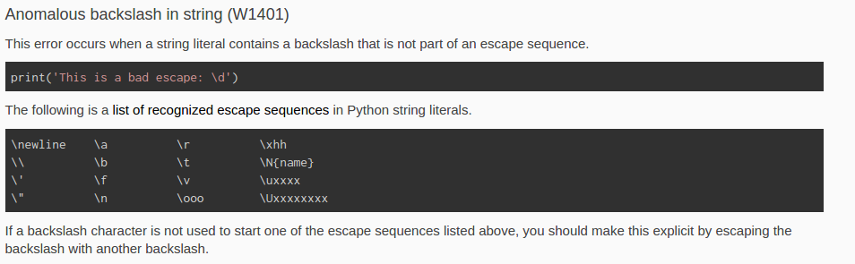
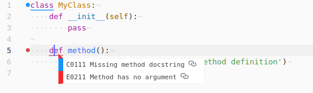

# 2017 Content Developer for PythonTA

- [Spreadsheet](https://docs.google.com/spreadsheets/d/1aNX6t_Edwqn9f9Y7gm8qCJeRuWyOPLvxAu9PF7TOOR8/edit#gid=1309916983)
- [Week 10](#week-9-july-24---july-31)
- [Week 9](#week-9-july-17---july-24)
- [Week 8](#week-8-july-10---july-17)
- [Week 7](#week-7-july-5---july-10)
- [Week 6](#week-6-june-19---july-5)
- [Week 4](#week-4-june-12---june-19)
- [Week 3](#week-3-june-5---june-12)
- [Week 2](#week-2-may-28---june-5)
- [Week 1](#week-1-may-22---may-28)

----

## Notes

- Consistent documentation for all examples.
  - Document function? Arguments? Return type?
  - Maybe no return types, since using `@type` and `@rtype` is not often used in Python outside this course?

----

## Week 10 (July 24 - July 31)

### Fix issues with previous pull requests

- [pyta-uoft/pyta#297](https://github.com/pyta-uoft/pyta/pull/297)
  - Build still failing, although it seems to pass on my local machine?

- [pyta-uoft/website#65](https://github.com/pyta-uoft/website/pull/65)
  - Some of the escape sequences only work in string literals. I included those escape sequences in the same table (not two tables like the Python documentation).
  - Table formating with the current style may not be ideal for presenting data (too much horizontal space; table is centered by default).
    

    Instead, I listed all escape patters in columns:

    

### In progress

#### Docstrings

Specifications:

1. [ ] Every function *should* have a docstring.
2. [ ] One-sentence description should be on same line as """. No space after """.
3. [ ] Function annotations: https://www.python.org/dev/peps/pep-0484/#type-definition-syntax. (Pay special attention to forward references https://www.python.org/dev/peps/pep-0484/#forward-references.)
4. [ ] Need to import https://docs.python.org/3/library/typing.html. Use List[T], Dict[K, V], and Tuple[T1, T2, T3,...]

#### Travis CI

- [`remark-lint`](https://github.com/wooorm/remark-lint) to lint markdown file (reads `.remarkrc` for tunable parameters).
- [`linkchecker`](https://wummel.github.io/linkchecker/) to check for dead links.

----

## Week 9 (July 17 - July 24)

### Progress

- 'Syntax errors'
  - [pyta-uoft/website#63](https://github.com/pyta-uoft/website/pull/63)
  - [pyta-uoft/pyta#295](https://github.com/pyta-uoft/pyta/pull/295)
  - Moved error examples into a separate `syntax_errors` folder.
  - Split 'Syntax errors' into two sections: **Syntax Error (E0001) {#E0001}** with subsections *1. SyntaxError: Missing parentheses in call to 'print'*, *2. SyntaxError: can't assign to literal*, *3. SyntaxError: invalid syntax* and **Indentation Error (E0002) {#E0002}** with subsections *1. IndentationError: unindent does not match any outer indentation level* and *2. IndentationError: unexpected indent*.
- 'Miscellaneous'
  - [pyta-uoft/website#64](https://github.com/pyta-uoft/website/pull/64)
  - [pyta-uoft/pyta#296](https://github.com/pyta-uoft/pyta/pull/296)
- 'Custom errors'
  - [pyta-uoft/website#65](https://github.com/pyta-uoft/website/pull/65)
  - [pyta-uoft/pyta#297](https://github.com/pyta-uoft/pyta/pull/297)

### Questions

- Maybe we could run the error code through the PyTA linter and display the error message together with PyTA comment and highlighting?
- Add travis tests for dead links?
- Add travis tests for Markdown code style (e.g. using [remark-lint](https://github.com/wooorm/remark-lint)). This includes checks for links that are defined at the bottom but are not used anywhere in the body.

----

## Week 8 (July 10 - July 17)

### Previous commits

- [Change example as discussed in meeting](https://github.com/pyta-uoft/pyta/pull/285/commits/da0da7f2b90badeacf5d199fdf0c64942054473d)

### Progress

- [website PR](https://github.com/pyta-uoft/website/pull/62)
- [PyTA PR](https://github.com/pyta-uoft/pyta/pull/288)
- I still maybe need another week to finish up this PR? I'm mostly happy with the changes that have been made already, but there are some errors that I still want to update.

### Questions

- OK to have links to error messages in inline format? For example, `[E1120](#E1120)`?
- Why is `super()` not used in CSC148?
- **Redundant unittest assert** - Examples are iffy because they don't import any code to be tested. But importing anything would probably fail unit tests?
- Syntax errors (at the end) are given as Python code blocks rather than being imported from a file.

----

## Week 7 (July 5 - July 10)

- Pull request for correcting the lists stylesheet and rephrasing Imports" errors:
  - [pyta-uoft/website#61](https://github.com/pyta-uoft/website/pull/61)
  - [pyta-uoft/pyta#285](https://github.com/pyta-uoft/pyta/pull/285)
- Reconsider changing function into inline code?:
  - [pyta-uoft/pyta#283](https://github.com/pyta-uoft/pyta/pull/283)

----

## Week 6 (June 19 - July 5)

### Progress

- Fix pull request from week 4:
  - [pyta-uoft/website#58](https://github.com/pyta-uoft/website/pull/58) (see commit [`ff58dee`](https://github.com/pyta-uoft/website/pull/58/commits/ff58dee))
  - [pyta-uoft/pyta#282](https://github.com/pyta-uoft/pyta/pull/282)
- Replace functions with code blocks in cases where the error does not happen for function arguments (e.g. `if not val <= 0: ...`). Add a better example for singleton comparison error (`if value == None: ...`):
  - [pyta-uoft/website#60](https://github.com/pyta-uoft/website/pull/60)
  - [pyta-uoft/pyta#283](https://github.com/pyta-uoft/pyta/pull/283)

### Questions

- Invalid constant name `number`, `number_category`, etc.
  - Tried inside `if __name__ == '__main__':` block, but get the same error.

----

## Week 4 (June 12 - June 19)

### ToDos from previous week

> Address issues in commits for week 3:
- https://github.com/pyta-uoft/website/pull/57

> Find a link to a website that talks about default parameters
- WIP:

### Progress

- Update **Code complexity** section of the website:
  - [Website PR](https://github.com/pyta-uoft/website/pull/58)
  - [PyTA PR](https://github.com/pyta-uoft/pyta/pull/258)
  - [Spreadsheet](https://docs.google.com/spreadsheets/d/1aNX6t_Edwqn9f9Y7gm8qCJeRuWyOPLvxAu9PF7TOOR8/edit?usp=sharing)
- Change the titles of each entry from `### CODE: Error description {Tag}` to `### Error description (CODE) {Tag}`"
  - [Website PR](https://github.com/pyta-uoft/website/pull/59)

### Questions

- Examples should be more standardized?
  - Common theme for all examples, e.g. statistics (`sum`, `mean(lst, skip_none=True)`, `count`, ...)?
  - Examples should have consistent docstrings?
  - Examples should be mostly correct with regard to other pylint errors (e.g. code discouraged by `R0102` in `C0113`, `C0121`, `W0125`).
- Maybe have everything in alphabetical order and build the table of contents based on tags?
  - Could have "see also" links below every error.

----

## Week 3 (June 5 - June 12)

### ToDos from previous week

> Add a test to make sure there are no dead links.
- Opened issue: https://github.com/pyta-uoft/website/issues/55

> List elements are not styled correctly.
- Opened issue: https://github.com/pyta-uoft/website/issues/56

> Address issues with the update to **Improper Python usage** section on the website:
- Added commits to PR: https://github.com/pyta-uoft/website/pull/54

### Progress

- Update **Type errors** section on the website
  - Website PR: https://github.com/pyta-uoft/website/pull/57
  - PyTA PR: https://github.com/pyta-uoft/pyta/pull/243
  - Spreadsheet: https://docs.google.com/spreadsheets/d/1aNX6t_Edwqn9f9Y7gm8qCJeRuWyOPLvxAu9PF7TOOR8/edit?usp=sharing

### Questions

- Is a single commit per error message better?
- How to keep track of concurrent changes in PyTA and website repos?
  - Move PyTA website into a `docs` folder in the PyTA repo?

----

## Week 2 (May 28 - June 5)

### ToDos from previous week

- > Maybe replace `>>> python_ta.doc('E9999')` with `>>> python_ta.doc('E9998')` in the README...
  - Actually, it's already correct. I got confused because the `E9998` error is displayed last. `E9999` is the error that the example is trying to demonstrate.

- > Problems with PyTA error messages and code highlighting for `E9997 (forbidden-global-variables)`
  - Created an issue on GitHub: https://github.com/pyta-uoft/pyta/issues/223

- > PyCharm plugin with a tooltop for a particular error message
  - Created an issue on GitHub: https://github.com/pyta-uoft/pyta/issues/229

### Progress

- Started going over and improving error descriptions on the website:
  - [Pull request](https://github.com/pyta-uoft/website/pull/54)
  - [Spreadsheet to keep track of progress](https://docs.google.com/spreadsheets/d/1aNX6t_Edwqn9f9Y7gm8qCJeRuWyOPLvxAu9PF7TOOR8/edit?usp=sharing)

### Questions

- Max line length in [index.md](https://github.com/pyta-uoft/website/blob/master/index.md)?
  - My code editor automatically wraps text at a specified line length, so I would prefer 1 line per paragraph.
  - But I can stick to 80 characters per line if that's better for everyone else.
- Add a test to make sure there are no dead links?
  - May be useful now that we are including links external resources.
  - Can open issue on GitHub?
- Different colours for warnings and errors?
  - Some errors are much worse than others (syntax errors vs. "bad smells"). Maybe this should be indicated somehow? (not sure if this would just lead to more confusion?)
- Make the title for each error "clickable"
  - Could generate a link for a particular section by clicking on a title.
  - Standard practice in e.g. documentation and README.md files displayed on GitHub
  - Turns issue for this already exists: https://github.com/pyta-uoft/website/issues/53
- Bullet lists not being parsed
  - Currently, lists appear as paragraphs in the rendered webpage.
  - i.e `<ul><li>...</li></ul>` look similar to `<o>...
`, without bullet points, etc.
  - For example [E0001](http://kimstg:8090/#E0001) is acually a nested list with two sections: *Python error message: "Missing parentheses in call to 'print'"* and *Python error message: "SyntaxError: invalid syntax"*
  - Can open an issue on GitHub, or try to fix this myself?

----

## Week 1 (May 22 - May 28)

### Install PyTA

- Everything works after cloning the repository and running `pip install -e .`.
- Maybe replace `>>> python_ta.doc('E9999')` with `>>> python_ta.doc('E9998')` in the README, so that it coincides with the error given by `>>> python_ta.check_all('examples.forbidden_import_example')`?

### Configure pylint

- Installed and configured pylint locally to make sure that I can reproduce all the errors.
- [linter-pylint](https://github.com/AtomLinter/linter-pylint) plugin for Atom produces tooltips describing an error and giving a link to more complete documentation. Not sure how much work it would be to adopt this to PyCharm and PyTA, but it could be very useful for students.
  - For example, the `examples/pylint/E0211_no_method_argument.py` file produces the following:
    
  - `E0211` link icon points to: http://pylint-messages.wikidot.com/messages:e0211.

### Website

- Created a list of errors which can be produced by pylint but are not covered in '.pylintrc' or 'index.md': see [missing_error_codes.ipynb](notebooks/missing_error_codes.ipynb).
- Briefly looked over the messages to see how they could be improved.
  - In ~50% cases, they look ok to me? Could add links to external resources, etc.
  - Some have errors and / or can clearly be expanded:
    - Inherit from `Exception`, not `BaseException`, and why `except` is not enough.
- Should I go over all the messages and correct the ones I clearly know how to change first?
- Should the errors be described in any particular order in `index.md`? At the moment, they are not in alphabetical order.

### PyTA

- Created a notebook with output generated by python_ta for all files in the "pyta/examples" directory: see [missing_error_codes.ipynb](http://nbviewer.jupyter.org/github/ostrokach/python-ta/blob/master/notebooks/python_ta_demo.ipynb) (link to nbviewer because github does not render the notebook properly).
- Discovered one problem so far:
  - `E9997 (forbidden-global-variables)`
    - This error is very easy to trigger and calls all sorts of functions and builtins (`range`, `function`, `print`) as variables.
    - Produces duplicate messages, highlighting a variable both when it is declared and used.
- Need to hide output for some errors and look at the output much more in-depth.

### Pull request structure

- I guess it does not make sense to have one pull request for each error?
